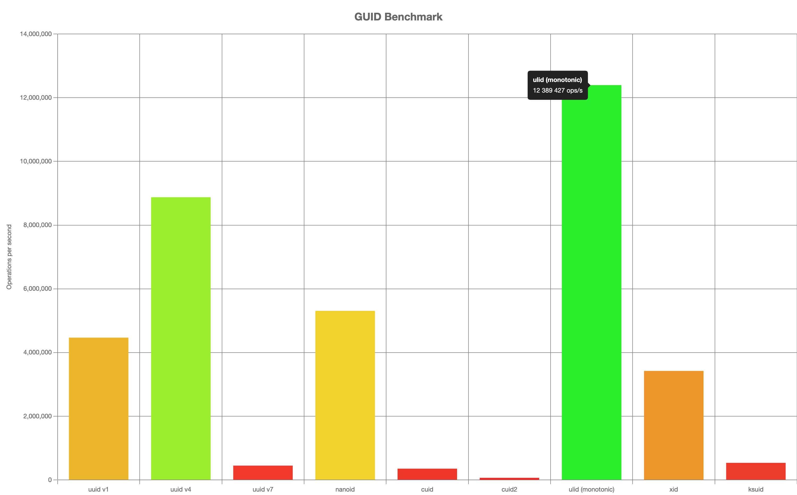

# Awesome Global Identifiers
The idea behind this project is to educate around Global identifiers, their specificities, benefits and short comings.

[Click Here to view the comparison table](https://adileo.github.io/awesome-identifiers/)


## Benchmark

*Disclaimer, these benchmark are performed against a given runtime architerture (JS/Arm), different implementation written in different languages and run against other architectures will likely give different results.*


Always remember, in term of pseudo random numbers, speed is generally not a factor of security. Depending of your requirements and context, slower may translate into better.

```
Platform info:
==============
   Darwin 22.2.0 arm64
   Node.JS: 18.12.1
   V8: 10.2.154.15-node.12
   CPU: Apple M1 Pro × 8
   Memory: 16 GB

Running "GUID Benchmark" suite...
Progress: 100%

  uuid v1:
    4 460 889 ops/s, ±0.57%    | 63.99% slower

  uuid v4:
    8 870 032 ops/s, ±0.54%    | 28.41% slower

  uuid v7:
    443 205 ops/s, ±0.82%      | 96.42% slower

  nanoid:
    5 300 343 ops/s, ±0.48%    | 57.22% slower

  cuid:
    347 037 ops/s, ±1.15%      | 97.2% slower

  cuid2:
    60 490 ops/s, ±0.52%       | slowest, 99.51% slower

  ulid (monotonic):
    12 389 427 ops/s, ±0.64%   | fastest

  xid:
    3 417 174 ops/s, ±0.41%    | 72.42% slower

  ksuid:
    532 223 ops/s, ±1.02%      | 95.7% slower

Finished 9 cases!
  Fastest: ulid (monotonic)
  Slowest: cuid2
```




## Contribute

Feel free to fork the repo adjust the table content and issue a pull request, every contribution is welcome.

## License
Attribution-ShareAlike 4.0 International [(CC BY-SA 4.0)](https://creativecommons.org/licenses/by-sa/4.0/)
