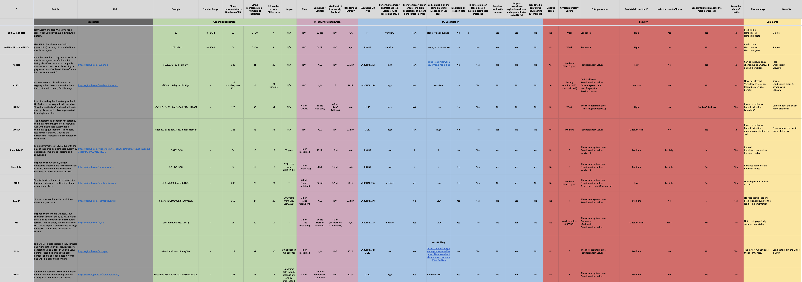

# Globally Unique Identifier Comparison

The idea behind this project is to provide education around GUID.


Why do you need a GUID?

GUID solve two problems typically inherent to 3 tiers architectures based on a RDMS.
Scalability
Security

What are the categories of GUID?

There are mainly two categories of GUIDs

|                   | Security | Indexing in DB |
| ----------------- | -------- | -------------- |
| Security Based    | +++      | --             |
| Performance Based | --       | +++            |
|                   |          |                |


Axioms used in this document

* The larger the number, the less chances of collisions
* Performance and security play against each other
* Database indexes perform poorly on random data


Context

* Risk of collision is not a generality, it is use case driven.
*  is spead across a multitide of entities
* The number of records in your tables is a key element to its security
* Ids are typically generated server side
* implementation platform -
* beyond the entropy size, the algorithm plays an important - randoms, hash, salts
* To date, there are no proofs that an id generation date is conisdered PII data.
* carefull with these native ids generated in NoSQL db, they are meant for data access, not security
* An id by itself, no matter how well is it randomized, is only a small component of a proper security architecture.




## Benchmark

*Disclaimer, these benchmark are performed against a given architerture (JS/Arm), different implementations/runtimes will likely give different results.*

Always remember, in term of pseudo random generation, **speed is generally not a factor of security**.

```
Platform info:
==============
   Darwin 22.2.0 arm64
   Node.JS: 18.12.1
   V8: 10.2.154.15-node.12
   CPU: Apple M1 Pro × 8
   Memory: 16 GB

Running "GUID Benchmark" suite...
Progress: 100%

  uuid v1:
    4 460 889 ops/s, ±0.57%    | 63.99% slower

  uuid v4:
    8 870 032 ops/s, ±0.54%    | 28.41% slower

  uuid v7:
    443 205 ops/s, ±0.82%      | 96.42% slower

  nanoid:
    5 300 343 ops/s, ±0.48%    | 57.22% slower

  cuid:
    347 037 ops/s, ±1.15%      | 97.2% slower

  cuid2:
    60 490 ops/s, ±0.52%       | slowest, 99.51% slower

  ulid (monotonic):
    12 389 427 ops/s, ±0.64%   | fastest

  xid:
    3 417 174 ops/s, ±0.41%    | 72.42% slower

  ksuid:
    532 223 ops/s, ±1.02%      | 95.7% slower

Finished 9 cases!
  Fastest: ulid (monotonic)
  Slowest: cuid2
```


## Definitions

### Collisions

A hash collision is a random match in hash values that occurs when a hashing algorithm produces the same hash value for two distinct pieces of data.

### Coordination

The communication between the different elements of a complex activity so as to enable them to work together effectively.

### Entropy

In Cryptography, refers to the randomness collected by a system for use in algorithms that require random seeds. (jargon word for "randomness")

### Monotonic

A monotonic generator ensures ids are always sorted in order. This term is particularly relevant to ordered guid generators which are based on time.

### Pagination

Pagination is a process that is used to divide a large data into smaller discrete pages. Commonly used in customer facing applications, pagination requires the notion of pointers on the dataset.

### Predictable

A random number generator is predictable if, after observing some of its “random” output, we can make accurate predictions about what “random values” are coming up next.

### Randomness

Randomness (entropy) is the cornerstone of cryptography. The more random the numbers, the more secure the cryptographic system. The challenge then, becomes one of generating true randomness.

## Contribute

Feel free to fork this repo and adjust the table content on google sheet.
Contribution and discussions are welcome!

